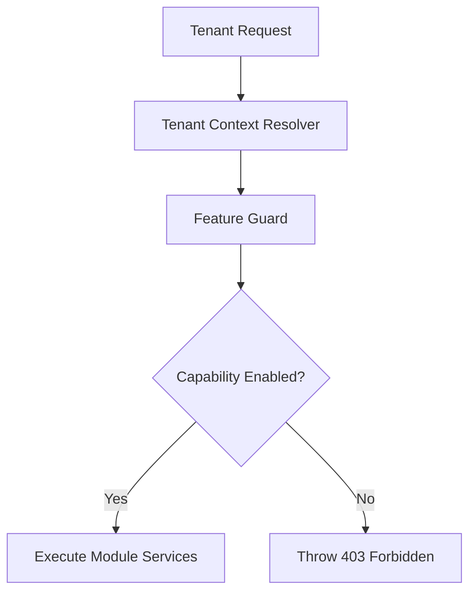

# Architecture Summary

This document summarizes the core components and systems architecture of **AK Business OS**.

## 1. Monorepo Strategy

We use **Turborepo** to orchestrate dependencies and build steps between:
- **`apps/api` (NestJS):** Provides REST controllers, GraphQL resolvers, core business models, auth guards, and tenant managers.
- **`apps/web` (Next.js):** Frontend pages with Next.js 13+ App Router, Tailwind CSS, and Framer Motion transitions.
- **`libs/` (Planned):** Extends applications with isolated capability libraries and dynamic industry packages.

## 2. Capability Registry Pattern

- **Feature Guard:** Resolves `tenantId` from request headers, cross-references database licenses, and grants access to active modules.
- **Dynamic Module Loading:** The backend initializes module controllers only when tenant config lists them as active, optimizing resource usage.

## 3. Database Isolation

- **Prisma Client:** Uses PostgreSQL.
- **Tenant Isolation:** Enforced via a mandatory `tenantId` parameter in database operations. Joint tables are not joined across different modules to avoid database coupling.
