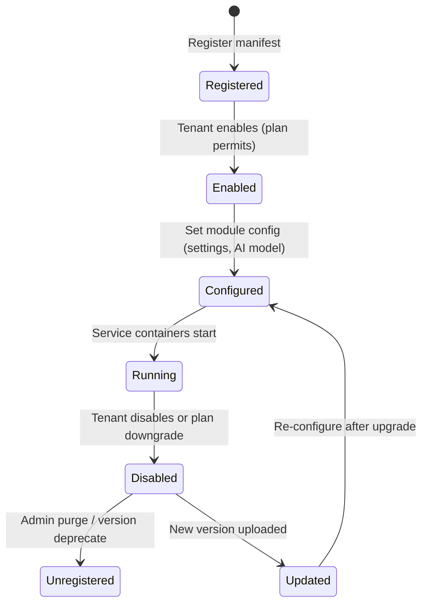

# AK Business OS – Module Engine Documentation

---

## 1. Overview
The **Module Engine** is the runtime core that turns every functional area of AK Business OS (Inventory, CRM, POS, Accounting, Payroll, HR, Marketing, Marketplace, Consumer, AI, etc.) into a **first‑class module**.  A module is a self‑contained bundle that can be **enabled**, **disabled**, **versioned**, and **extended** without affecting the rest of the platform.

### Core Responsibilities
| Responsibility | Description |
|----------------|-------------|
| **Module Registry** | Stores metadata (name, version, manifest, dependencies). |
| **Lifecycle Manager** | Handles state transitions (register → enable → disable → unregister). |
| **Permission Engine** | Enforces fine‑grained RBAC/ABAC per‑module action. |
| **Subscription & Industry Pack Resolver** | Determines whether a tenant may access a module based on its plan and industry profile. |
| **AI Integration Layer** | Exposes module‑level AI hooks (model inference, data pipelines). |
| **Marketplace Connector** | Allows third‑party extensions to be discovered, installed, and sandboxed. |
| **API Gateway** | Generates per‑module REST/GraphQL endpoints and SDK bindings. |
| **Event Bus** | Publishes and subscribes to domain events across modules. |
| **Dependency Resolver** | Computes load order, validates version constraints, and isolates conflicts. |

---

## 2. Architectural Diagram

```mermaid
flowchart TB
    subgraph Platform Core
        R[Module Registry] --> L[Lifecycle Manager]
        L --> P[Permission Engine]
        L --> S[Subscription & Industry Pack Resolver]
        L --> A[AI Integration Layer]
        L --> M[Marketplace Connector]
        L --> G[API Gateway]
        L --> E[Event Bus]
        L --> D[Dependency Resolver]
    end

    subgraph Tenant Runtime
        T1[Enabled Module: Inventory] --> E
        T2[Enabled Module: CRM] --> E
        T3[Enabled Module: POS] --> E
        T4[Enabled Module: Accounting] --> E
        T5[Enabled Module: Payroll] --> E
        T6[Enabled Module: HR] --> E
        T7[Enabled Module: Marketing] --> E
        T8[Enabled Module: Marketplace] --> E
        T9[Enabled Module: Consumer] --> E
        T10[Enabled Module: AI] --> E
    end

    style Platform Core fill:#f0f8ff,stroke:#333,stroke-width:2px
    style Tenant Runtime fill:#e6ffe6,stroke:#333,stroke-width:2px
```


---

## 3. Module Lifecycle Diagram


### State Descriptions
- **Registered** – Manifest is stored; dependencies are validated.
- **Enabled** – Module is granted access based on subscription/industry pack.
- **Configured** – Tenant‑specific settings (e.g., tax rules for Accounting, AI model variant for Inventory) are persisted.
- **Running** – Module’s micro‑services, workers, and UI components are active.
- **Disabled** – All runtime containers are stopped; data remains for later re‑enable.
- **Unregistered** – Manifest removed; data may be archived.
- **Updated** – New version replaces old one; transition follows **Disabled → Updated → Configured**.

---

## 4. Module Feature Matrix (What each module must implement)
| Feature | Description |
|---------|-------------|
| **Enable / Disable** | Boolean flag in the tenant’s configuration; toggles runtime containers and API exposure. |
| **Permissions** | Module supplies a `permissions.json` describing actions (e.g., `inventory:read`, `inventory:write`). The Permission Engine merges these into the global RBAC model. |
| **Subscription Plans** | Each module declares a `plan_requirements` block (e.g., `basic: false`, `pro: true`). The Subscription Resolver checks tenant plan before enabling. |
| **Industry Packs** | Optional industry‑specific extensions (e.g., `RetailPack` for POS). Declared in `industry_packs` manifest. |
| **AI** | Exposes hooks `onEvent(event) → inference` or `predict(request)`. Modules can elect to use shared AI services or host their own model. |
| **Marketplace Extensions** | Allows third‑party add‑ons to register additional endpoints, UI components, or data sources under the parent module’s namespace. |
| **API** | Automatic generation of OpenAPI spec from module’s `api.yaml`. The API Gateway stitches them under `/api/v1/{module}`. |
| **Events** | Modules publish domain events (`ItemCreated`, `OrderPaid`) to the central Event Bus. Other modules can subscribe via `event_subscriptions` manifest. |

---

## 5. Module Communication
### 5.1 Synchronous API Calls
- Modules call each other through the **API Gateway** using a stable URL pattern:
  ```
  GET /api/v1/inventory/stock?sku=12345
  POST /api/v1/payroll/run
  ```
- Authentication is handled via JWT scoped to the calling module’s service account.

### 5.2 Asynchronous Events
- **Event Bus** (Kafka‑style) carries immutable events.
- Event schema versioned via **Schema Registry**.
- Example flow: `POS` publishes `OrderPlaced`; `Inventory` consumes it to decrement stock; `Accounting` consumes to create a revenue entry; `AI` consumes for demand forecasting.

### 5.3 Shared Data Layer
- Core data (tenants, users, audit logs) resides in a **multi‑tenant DB** accessed via DAL abstractions; modules never directly query each other’s tables.
- **Read‑through cache** (Redis) provides fast look‑ups for cross‑module look‑ups.

---

## 6. Dependency Management
1. **Manifest Declaration** – Each module ships a `module.json`:
   ```json
   {
     "name": "inventory",
     "version": "2.4.1",
     "requires": [{"name":"product","min":"2.0.0"}],
     "optional": [{"name":"ai-forecast","min":"1.1.0"}],
     "conflicts": [{"name":"legacy-inventory"}]
   }
   ```
2. **Resolution Algorithm**
   - Gather all enabled modules for a tenant.
   - Build a directed graph of **required** edges.
   - Perform a topological sort; if cycles exist, abort with a clear error.
   - Validate version constraints using **Semantic Versioning** ranges.
   - Optional dependencies are loaded if available; otherwise the dependent module runs in degraded mode.
3. **Conflict Handling**
   - If two modules declare `conflicts` with each other, the resolver disables the lower‑priority module (priority = plan tier → industry pack → explicit admin order).
4. **Isolation**
   - Each module runs in its own **container** with its own runtime dependencies (Node, Python, etc.) to avoid library clashes.

---

## 7. Versioning Strategy
- **Semantic Versioning (MAJOR.MINOR.PATCH)** is enforced for every module.
- **Compatibility Guarantees**
  - **MAJOR** bump → breaking API or data model. Requires tenant migration plan.
  - **MINOR** bump → backward‑compatible additions (new endpoints, events). No migration needed.
  - **PATCH** bump → bug fixes, performance improvements.
- **Deprecation Policy**
  - A MAJOR version is deprecated after **12 months** post‑release of the next MAJOR.
  - Tenants receive migration guides and can opt‑in to a **compatibility shim** for up to 3 months.
- **Version Registry** – Central store (`module_registry`) holds all released versions and their compatibility matrix.
- **Upgrade Path** – The Lifecycle Manager can **auto‑upgrade** MINOR/PATCH when `auto_update=true`; MAJOR upgrades must be approved by an admin.

---

## 8. Subscription & Industry Pack Integration
1. **Plan Matrix** – Each plan (Free, Starter, Professional, Enterprise) defines a set of **allowed modules** and the maximum allowed **MAJOR version**.
2. **Industry Packs** – A pack (e.g., `RetailPack`, `HealthcarePack`) is an additive bundle that unlocks additional modules or specialized configurations.
3. **Resolver Flow**
   - When a tenant attempts to enable a module, the **Subscription Resolver** checks:
     a) Is the module listed in the tenant’s plan? 
     b) Does the tenant have the required industry pack? 
   - If not, the enable operation fails with a clear message.
4. **Marketplace Extensions**
   - Marketplace add‑ons are also gated by plan/industry pack. A third‑party extension can declare a `required_plan` field.

---

## 9. AI Integration Model
- **Shared AI Service Bus** – Central AI Platform offers generic endpoints (`/ai/predict`, `/ai/train`). Modules register **hooks**.
- **Per‑Module AI Hooks** – Example: Inventory registers `stock-forecast` that the AI service calls with recent sales data.
- **Model Versioning** – AI models use their own semantic versioning; modules specify `model_range` in the manifest.
- **Data Privacy** – Tenant data is isolated; AI jobs run in a **secure enclave** with audit logs.

---

## 10. Marketplace Extension Architecture
```mermaid
flowchart LR
    Subgraph Marketplace
        MExt[Extension Package]
        MExt -->|Registers| ExtManifest[Extension Manifest]
    end
    ExtManifest -->|Validated by| MConnector[Marketplace Connector]
    MConnector -->|Installs into| ModuleEngine[Module Engine]
    ModuleEngine -->|Exposes| API[Extended API]
    ModuleEngine -->|Publishes| Events[Extended Events]
```
- An extension ships its own **manifest** (`extension.json`) describing new endpoints, events, UI components, and required permissions.
- The **Marketplace Connector** validates the package, runs sandboxed tests, and writes the extension metadata to the parent module’s record.
- Once approved, the extension is **dynamically loaded** into the parent module’s runtime container.

---

## 11. Event Schema & Versioning
- Events are defined in a **JSON Schema** stored in a **Schema Registry**.
- Each event carries a `schema_version` header.
- Consumers declare the **minimum version** they support; the Event Bus will **transform** older versions on the fly when a backward‑compatible change occurs (e.g., adding optional fields).
- Breaking changes require a new event name (e.g., `OrderPlacedV2`).

---

## 12. Governance & Auditing
- **Audit Log** records every module state change (enable/disable, version upgrade, permission change) with tenant ID, user ID, timestamp, and diff.
- **Policy Engine** can enforce rules such as “Critical modules (Accounting, Payroll) cannot be disabled by non‑admin users”.
- **Health Dashboard** shows module health (uptime, error rate) per tenant.

---

## 13. Summary
The **Module Engine** provides a robust, extensible foundation for AK Business OS:
- Uniform enable/disable lifecycle across all functional areas.
- Fine‑grained permission and subscription gating.
- Plug‑and‑play AI hooks and Marketplace extensions.
- Consistent API surface and event‑driven communication.
- Declarative dependency and version management ensures safe upgrades.
- Designed to scale from SMB (single‑module) to enterprise (full suite with custom extensions).

---

*Document generated on 2026‑07‑02.*
