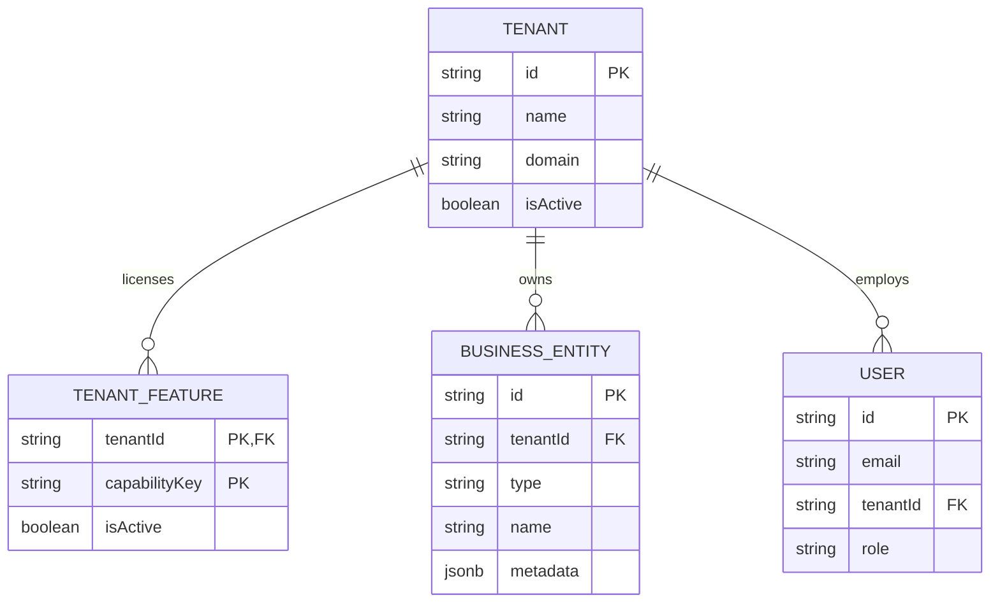

# Database Architecture & Schema Guidelines

This document details database architecture, schemas, and multi-tenant constraints for **AK Business OS**.

## 1. Schema Partitioning (Logical Multi-Tenancy)

We enforce logical tenant isolation. All shared tables must store a `tenantId` (cuid reference) column:
- All database queries must explicitly scope transactions with `WHERE tenant_id = :tenantId`.
- Unique indexes combining `id` and `tenantId` prevent cross-tenant operations.

## 2. Core ER Model Overview

## 3. Dynamic Attributes (JSONB)

To avoid endless database migrations when creating specific industry packs, core tables use a `metadata` JSONB column. 
- Custom fields (e.g. `cuisine` for restaurant packs, `sku` variations for retail packs) are stored within `metadata`.
- Perform queries on JSONB attributes using PostgreSQL GIN indexes to maintain index efficiency.
