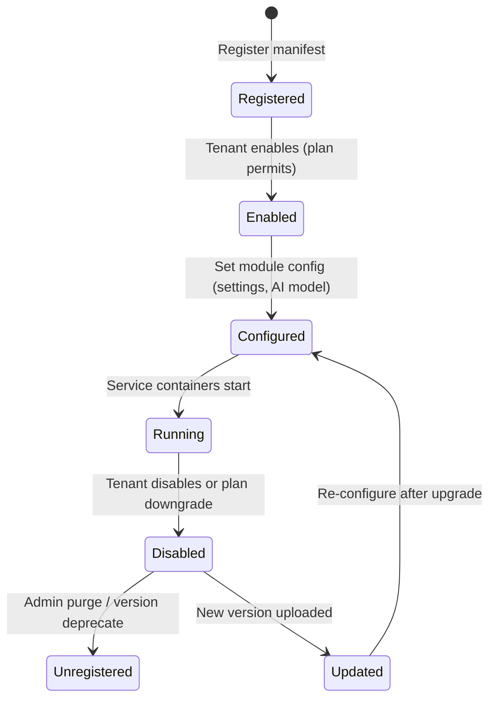

# Specification: Module Engine Module

---

## 1. Architectural Overview
The **Module Engine** is the runtime core that turns every functional area of AK Business OS (Inventory, CRM, POS, Accounting, Payroll, HR, Marketing, Marketplace, Consumer, AI, etc.) into a **first‑class module**. A module is a self‑contained bundle that can be **enabled**, **disabled**, **versioned**, and **extended** without affecting the rest of the platform.

### Core Responsibilities
| Responsibility | Description |
|----------------|-------------|
| **Module Registry** | Stores metadata (name, version, manifest, dependencies). |
| **Lifecycle Manager** | Handles state transitions (register → enable → disable → unregister). |
| **Permission Engine** | Enforces fine‑grained RBAC/ABAC per‑module action. |
| **Subscription & Industry Pack Resolver** | Determines whether a tenant may access a module based on its plan and industry profile. |
| **AI Integration Layer** | Exposes module‑level AI hooks (model inference, data pipelines). |
| **Marketplace Connector** | Allows third‑party extensions to be discovered, installed, and sandboxed. |
| **API Gateway** | Generates per‑module REST/GraphQL endpoints and SDK bindings. |
| **Event Bus** | Publishes and subscribes to domain events across modules. |
| **Dependency Resolver** | Computes load order, validates version constraints, and isolates conflicts. |

### Module Communication
- **Synchronous API Calls:** Modules call each other through the **API Gateway** using a stable URL pattern: `/api/v1/{module}/{endpoint}`. Authentication is handled via JWT scoped to the calling module’s service account.
- **Asynchronous Events:** The central Event Bus (Kafka-style) carries versioned, JSON-schema-validated domain events.
- **Shared Data Layer:** Core tenant and user records reside in a multi-tenant PostgreSQL DB. Modules never directly join or query other modules' tables.

---

## 2. Technical Specifications & Interfaces
- **Table Mapping:** `tenant_features` (join table for tenant and capability registration keys).
- **Core Interfaces:**
  ```typescript
  interface ModuleEngineService {
    enableFeature(tenantId: string, featureKey: string): Promise<void>;
    disableFeature(tenantId: string, featureKey: string): Promise<void>;
    listEnabledFeatures(tenantId: string): Promise<string[]>;
  }
  ```

---

## 3. Endpoints & API Contract
- `GET /api/v1/modules` - List all system capability definitions and active statuses.
- `POST /api/v1/modules/enable` - Subscribes a tenant to a designated capability module.
- `POST /api/v1/modules/disable` - Deactivates capability module access for the tenant.

---

## 4. Lifecycle & State Machine

- **Registered** – Manifest is stored; dependencies are validated.
- **Enabled** – Module is granted access based on subscription/industry pack.
- **Configured** – Tenant‑specific settings are persisted.
- **Running** – Module’s micro‑services, workers, and UI components are active.
- **Disabled** – All runtime containers are stopped; data remains for later re‑enable.
- **Unregistered** – Manifest removed; data may be archived.
