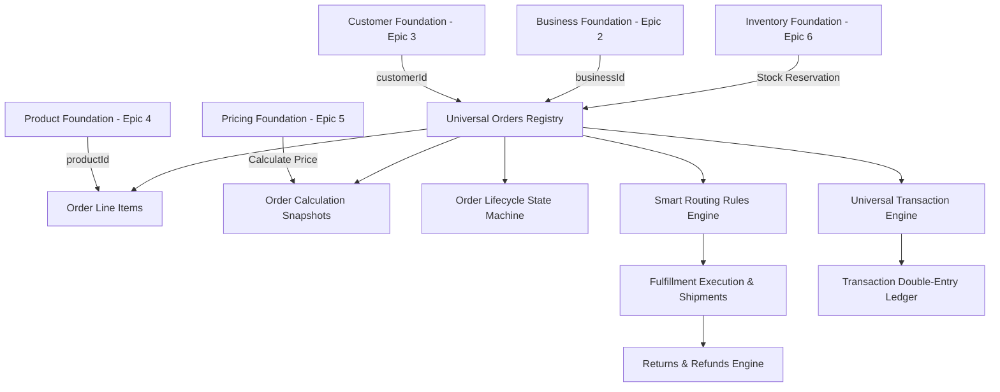

# Order & Transaction Foundation Architecture

## Platform Integrations
- **Tenant Isolation**: `@TenantId()` header parameter + `TenantGuard`.
- **RBAC**: `@UseGuards(JwtAuthGuard)`.
- **Audit Platform**: `AuditService.logEvent()`.
- **Event Bus**: 23 Domain Events emitted via `EventBusService.publish()`.
- **Soft Delete**: Non-destructive deletion (`deletedAt`) across core entities.
