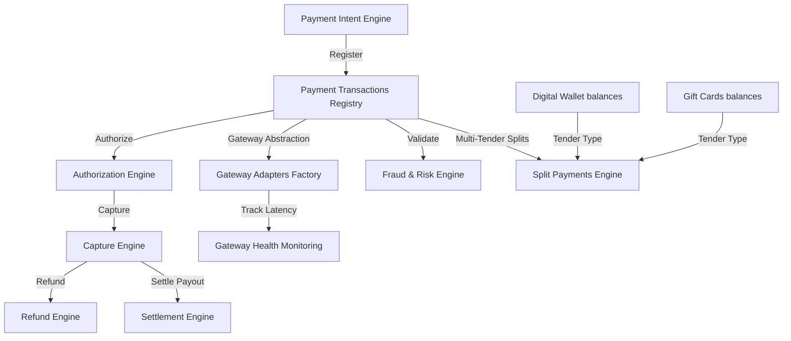

# Universal Payment & Settlement Foundation Architecture

## Bounded Boundaries
- **Decoupled Gateway Abstraction**: All physical payment processors conform to `IPaymentGatewayAdapter` interface. No Stripe or Adyen specific logic leaks into the core engine.
- **PCI Readiness**: No actual credit card numbers are ever stored in the database. Cards are transformed into vault tokens (`payment_tokens`) with expiry and rotation hooks.
- **Workflow & Event Integration**: Custom operations dispatch NestJS domain events via `EventBusService`.
- **Multi-Tenant Protection**: Handled via `TenantGuard`.
