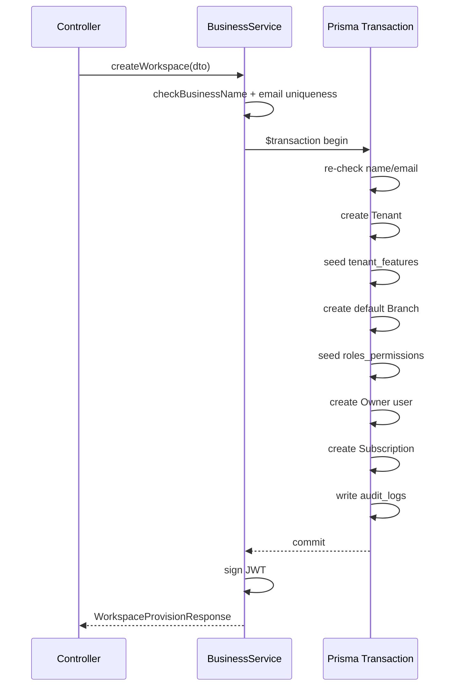

# Implementation Notes — Business Workspace API (Milestone 1B)

**Branch:** `business-os-v2`  
**Sprint:** 1 — Milestone 1B  
**Status:** Complete (backend API only)

## Scope delivered

- Global API prefix: `/api/v1`
- Workspace provisioning endpoint with single-transaction rollback
- Lookup endpoints for industries, currencies, timezones, and name availability
- Structured provisioning response model
- Unit tests and e2e tests

## Out of scope (by design)

- Frontend onboarding and dashboard
- Database schema changes (Milestone 1A foundation reused as-is)
- Dedicated Tenant/User/Subscription/Notification micro-services

## Architecture decisions

### Tenant as workspace + business

There is no separate `business_entities` table in Milestone 1A. The `Tenant` model (`restaurants` table) represents both:

- **Workspace** — multi-tenant root, settings JSON, modules, roles
- **Business** — legal/operational metadata (`name`, `industry`, `currency`, `timezone`)

The API response exposes a `business` summary object mapped from the tenant record.

### Consolidated provisioning service

All provisioning logic lives in `BusinessService.createWorkspace()`. Existing auth, permissions, and restaurants modules were reused; no duplicate services were introduced.

### Role alignment fix

Owner users are created with `UserRole.RESTAURANT_OWNER`. The transaction also seeds a matching `roles_permissions` row for `RESTAURANT_OWNER` with `['*']`, so `PermissionsGuard` resolves correctly on guarded routes.

### Reference data

Industries, currencies, and timezones are served from `business.constants.ts` (static catalog). Industry packs drive default modules and role templates at provisioning time.

## Transaction flow

On any failure inside `$transaction`, Prisma rolls back all writes.

## Files

| Action | Path |
|--------|------|
| Created | `apps/api/src/business/business.constants.ts` |
| Created | `apps/api/src/business/dto/create-workspace.dto.ts` |
| Created | `apps/api/src/business/dto/check-name-query.dto.ts` |
| Created | `apps/api/src/business/models/workspace-provision.response.ts` |
| Created | `apps/api/src/business/business.service.spec.ts` |
| Created | `apps/api/test/business.e2e-spec.ts` |
| Modified | `apps/api/src/business/business.service.ts` |
| Modified | `apps/api/src/business/business.controller.ts` |
| Modified | `apps/api/src/business/dto/register-business.dto.ts` |
| Modified | `apps/api/src/main.ts` |
| Modified | `apps/api/test/app.e2e-spec.ts` |

## Next milestone (1C)

Await approval before frontend onboarding integration and dashboard wiring.
