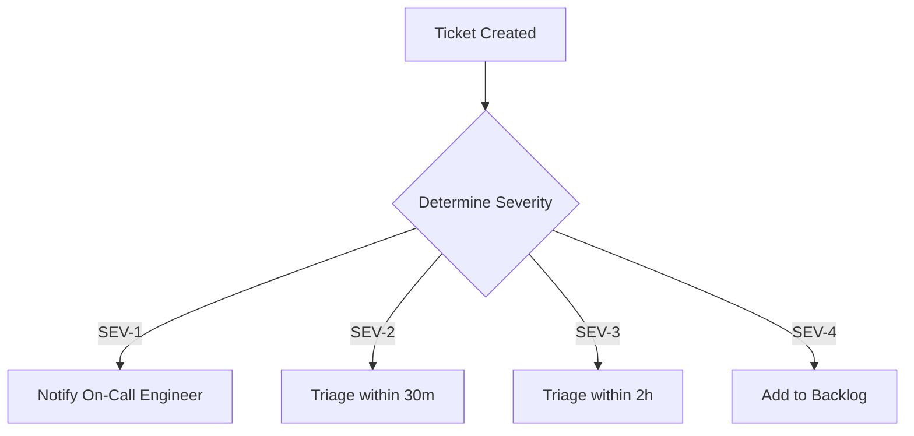

# Phase 28 — Pilot Support Runbook

This runbook defines ticketing operations and support triage paths during pilot onboarding.

---

## 1. Triage Workflow

---

## 2. Escalation SLAs

- **SEV-1 Critical**: Core system unusable. Developer intervention target: <15 Minutes.
- **SEV-2 High**: Operational feature degraded. Resolution target: <30 Minutes.
- **SEV-3 Medium**: Minor bug with workarounds. Resolution target: <2 Hours.
- **SEV-4 Low**: Cosmetic layout or suggestions. Resolution target: <24 Hours.
