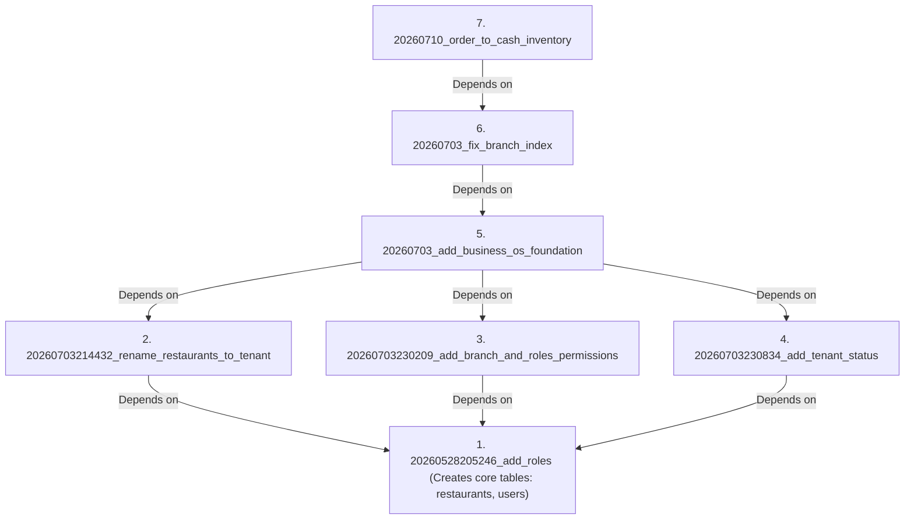

# Phase 29 — Migration Dependency Graph

This document mapping outlines the logical dependencies of the database migrations.

---

## 1. Dependency Graph

---

## 2. Inherent Mismatches in Active History

Prisma CLI orders migrations by parsing their folder prefix timestamps as integers. 
- `20260703` (8 digits) is evaluated as a smaller number than `20260703214432` (14 digits).
- Consequently, Prisma attempts to execute `20260703_add_business_os_foundation` *before* the migrations that create the `branches` and `status` columns, causing execution failure.
