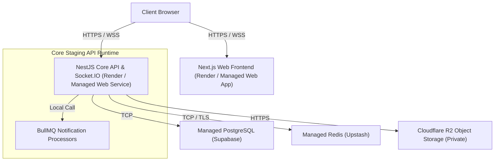

# Phase 29K — Managed Hosting Architecture

This document describes the recommended runtime topology and managed service mappings for deploying the controlled staging/pilot environment.

---

## 1. Process Topology Mapping

---

## 2. Process Classification

- **HTTP Services**: 
  - `apps/web`: Next.js web application (Serves client requests, pages, dashboard console).
  - `apps/api`: NestJS API application (Serves backend REST endpoints, Socket.IO websocket connections).
- **Background Workers**: 
  - `BullMQ Processors`: Executes inside the `apps/api` main process (handles email, SMS, and webhook deliveries asynchronously).
- **Managed Databases**:
  - `PostgreSQL`: Supabase staging DB cluster.
  - `Redis Cache`: Upstash Redis instance (Supports TLS, native Redis protocol commands, persistent worker connections).
- **Object Storage**:
  - `Cloudflare R2`: S3-compatible private asset storage (Private-by-default objects, signed URLs).
- **Security / KMS**:
  - `SAAS_MASTER_ENCRYPTION_KEY`: Environment MEK wrapping key. Sufficient for controlled pilot environment.
