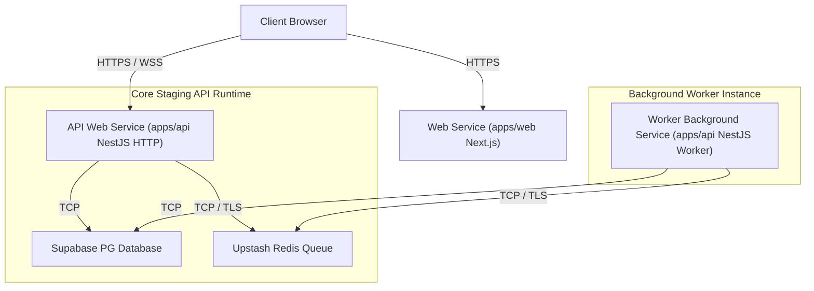

# Phase 29K — Render Deployment Architecture

This document describes the staging architecture configured for Render.

---

## 1. Process Separation Topology

- **Web Service**: Serves Next.js frontend pages. Port: `3000`.
- **API Web Service**: Serves REST and Socket.IO NestJS core backend. Port: `3001` (CORS and cookie sessions active, does not load queue processors).
- **Background Worker**: Standalone application context without port bindings. Runs with `RUN_MODE=worker` to listen to Upstash queues.
- **Supabase PostgreSQL**: Shared database instance.
- **Upstash Redis**: Managed queue cluster.
